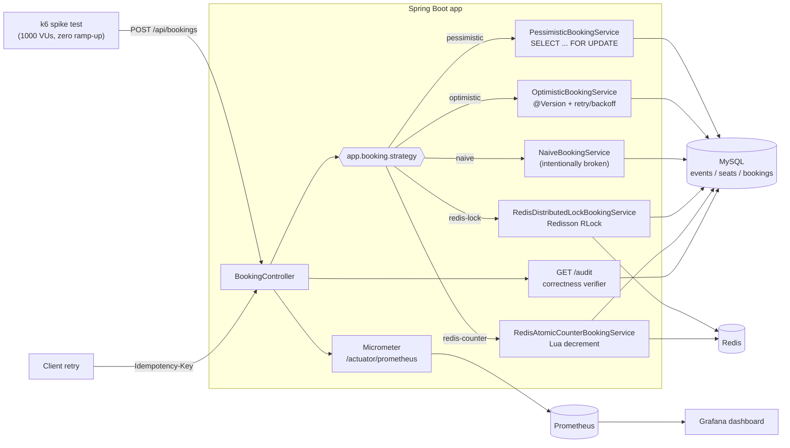

# Ticket Booking System — Concurrent Seat Booking

A ticket-booking API for exactly one purpose: proving, with numbers, which
concurrency-control strategy stops a seat-booking system from overselling
under real concurrent load. The domain is deliberately tiny (`Event`,
`Seat`, `Booking` — no auth, no payments, no email) so that all the effort
goes into the concurrency story: a naive implementation that provably
oversells, four different fixes (pessimistic locking, optimistic locking,
a Redis distributed lock, a Redis atomic counter), each benchmarked against
the same k6 spike test and measured with the same correctness auditor.

## Architecture



One `BookingService` implementation is active at a time, selected by
`app.booking.strategy` — this keeps `/api/bookings` a single, realistic
endpoint instead of one route per strategy, while still letting each
strategy be benchmarked independently (set the property, restart, run k6).

## Benchmarks

**Status: builds clean, not yet run.** The code compiles and packages into
a runnable jar (verified locally). Docker is not available on the dev
machine, so nothing that needs MySQL/Redis has actually executed yet —
every number below is `TBD` on principle, not estimated. See
[`docs/BENCHMARKS.md`](docs/BENCHMARKS.md) for exactly what's needed to
fill this in for real (`scripts/bench.sh`, which needs `docker`, `mvn`,
`java`, `k6`, `curl` on `PATH`).

| Strategy | Throughput (req/s) | p95 | p99 | Errors | Oversold |
|---|---|---|---|---|---|
| Naive (baseline) | TBD | TBD | TBD | TBD | TBD |
| Pessimistic lock | TBD | TBD | TBD | TBD | TBD |
| Optimistic + retry | TBD | TBD | TBD | TBD | TBD |
| Redis distributed lock | TBD | TBD | TBD | TBD | TBD |
| Redis atomic counter | TBD | TBD | TBD | TBD | TBD |

## Running it

```bash
docker compose up -d          # MySQL, Redis, Prometheus, Grafana
mvn spring-boot:run            # boots the app on :8080
curl localhost:8080/api/events/1/availability
```

To actually produce the benchmark table above (resets the DB, boots the
app, runs the k6 spike, prints the audit result):

```bash
scripts/bench.sh
```

Switch strategy before benchmarking by setting `app.booking.strategy` in
`src/main/resources/application.yml` (or as an env var) to one of `naive`,
`pessimistic` (default), `optimistic`, `redis-lock`, `redis-counter`, then
restart before running `scripts/bench.sh` again.

## Docs

- [`docs/BENCHMARKS.md`](docs/BENCHMARKS.md) — the numbers, and how to produce them
- [`docs/ADR-001-locking-strategy.md`](docs/ADR-001-locking-strategy.md) — pessimistic vs optimistic locking
- [`docs/ADR-002-redis-locking.md`](docs/ADR-002-redis-locking.md) — Redis lock failure modes, why Redlock is contested
- [`docs/INTERVIEW-NOTES.md`](docs/INTERVIEW-NOTES.md) — per-strategy tradeoffs and the hardest bug caught building this

## Stack

Java 21, Spring Boot 3, MySQL 8 (real MySQL — never H2, since the project
depends on real row-locking semantics), Redis 7 + Redisson, Flyway, Docker
Compose, k6, Micrometer → Prometheus → Grafana, JUnit 5 + Testcontainers
(real MySQL/Redis in tests too — a mock cannot have a race condition).
